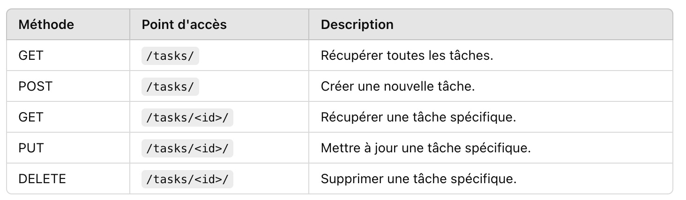

# API Liste de Tâches

Une API de gestion de tâches développée avec Django, conçue pour gérer vos tâches efficacement (Apprendre Django Rest Framework).

## Fonctionnalités

- **Opérations CRUD** : Créer, Lire, Mettre à jour et Supprimer des tâches.
- **Priorisation des tâches** : Organisez les tâches par niveaux de priorité.
- **Dates limites** : Définissez des échéances pour chaque tâche.
- **Authentification des utilisateurs** : Accès sécurisé grâce à l'authentification.

## Prérequis

- Python 3.x
- Django 4.x
- SQLite (base de données par défaut)

## Installation

1. **Cloner le dépôt**

   ```bash
   git clone https://github.com/CodeKilla0/To-Do-List-API
   cd To-Do-List-API
   ```

2. **Créer un environnement virtuel**
   python -m venv env
   source env/bin/activate # Pour Linux/MacOS
   env\Scripts\activate

3. **Installer les dépendances**
   pip install -r requirements.txt

4. **Exécuter les migrations**
   python manage.py migrate

5. **Lancer le serveur de développement**
   python manage.py runserver

# Points d'accès API



# Exemple de JSON pour une tâche

Créer ou Mettre à jour une tâche

```json
{
  "title": "Acheter des courses",
  "description": "Lait, Pain, et Œufs",
  "priority": "Haute",
  "due_date": "2024-01-01"
}
```

# Exemple de reponse

```json
{
  "id": 1,
  "title": "Acheter des courses",
  "description": "Lait, Pain, et Œufs",
  "priority": "Haute",
  "due_date": "2024-01-01",
  "created_at": "2024-12-30T10:00:00Z",
  "updated_at": "2024-12-30T10:00:00Z"
}
```

# Authentification
L'API utilise une authentification basée sur des jetons. Obtenez un jeton 
en envoyant vos identifiants à /api/token/ :

POST /api/token/
```json
{
  "username": "votre_nom_utilisateur",
  "password": "votre_mot_de_passe"
}
```
Utilisez ce jeton dans l'en-tête Authorization pour les requêtes suivantes :
Authorization: Bearer votre_jeton


# Contribution
Les contributions sont les bienvenues ! N'hésitez pas à forker le dépôt et à soumettre une pull request.

# Licence
Ce projet est sous licence MIT.

# Contact
Pour toute question, vous pouvez me contacter à aziz.diomande@epitech.com.


